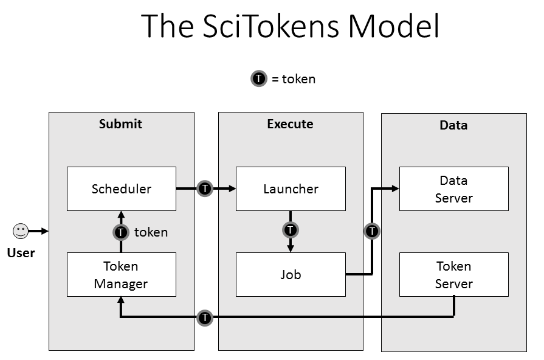

The SciTokens project is building a federated ecosystem for authorization on distributed scientific computing infrastructures.

What's New?
-----------

* January 2019: [Syracuse SciTokens Setup](https://gist.github.com/duncan-brown/fb5e83b86814baeda001316a6bdfcc3b)
* February 2019: [SciTokens Credential Monitor available for HTCondor](https://github.com/htcondor/scitokens-credmon)
* March 2019: [SciTokens at HOW2019](https://groups.google.com/a/scitokens.org/forum/#!msg/announce/WJjSf2PQTmI/a97bA05tDAAJ)
* April 2019: [SciTokens input on the WLCG Common JWT Profile](https://docs.google.com/document/d/1cNm4nBl9ELhExwLxswpxLLNTuz8pT38-b_DewEyEWug/edit?usp=sharing)
* May 2019: [SciTokens at HTCondor Week](https://agenda.hep.wisc.edu/event/1325/session/17/contribution/17)

Email Lists
-----------

For SciTokens project updates and discussions, join our email lists:

*   announce@scitokens.org ([subscribe](mailto:announce+subscribe@scitokens.org)) ([archives](https://groups.google.com/a/scitokens.org/d/forum/announce))
*   discuss@scitokens.org ([subscribe](mailto:discuss+subscribe@scitokens.org)) ([archives](https://groups.google.com/a/scitokens.org/d/forum/discuss))

Upcoming Events
---------------

Meet the [SciTokens Team](team) at the following upcoming events:

* May 20-23: [HTCondor Week](https://agenda.hep.wisc.edu/event/1325/)
* July 28 - August 1: [PEARC19](https://www.pearc19.pearc.org/)

SciTokens Code
--------------

* Libraries: [Python](https://github.com/scitokens/scitokens) [C++](https://github.com/scitokens/scitokens-cpp)
* Integrations: [CVMFS](https://github.com/scitokens/cvmfs-scitokens-helper) [NGINX](https://github.com/scitokens/nginx-scitokens) [XRootD](https://github.com/scitokens/xrootd-scitokens)
* [HTCondor CredMon](https://github.com/htcondor/scitokens-credmon)
* [Token Server](https://github.com/scitokens/scitokens-java)

The SciTokens Mission
---------------------

We believe that distributed, scientific computing community has unique authorization needs that can be met by utilizing common web technologies, such as [OAuth 2.0](https://tools.ietf.org/html/rfc6749) and [JSON Web Tokens](https://tools.ietf.org/html/rfc7519).  The [SciTokens Team](team), a collaboration between technology providers and domain scientists, is working to build and demonstrate a new authorization approach at scale.

In distributed computing, a natural unit of organization is the "virtual organization" (VO), typically a group or community representing a science domain or experiment that might span several physical institutions (such as a university of lab).  The VO has its own mechanisms to determine membership and access policies for resources it owns.  SciTokens aims to provide an infrastructure that allows the VO to issue bearer tokens that focus on the _capabilities_ the bearer should have within the VO's namespace, as opposed to the _identity_ of the bearer.  This frees resource providers from needing to duplicate VO authorization policies based on identity mapping.

The SciTokens Model
----------------------

The SciTokens project is developing a data access architecture for use with [LIGO](https://ligo.org/) and [LSST](https://www.lsst.org/) workflows.  The architecture is shown below:

Users logged in to a specific host generate a _refresh_ token and store it on the local token manager.  They then submit jobs to the local queue manager.  When the queue manager is prepared to execute the user's jobs, it contacts the token manager to create an _access token_.  The queue manager sends the access token to the execute host and places it in the job runtime environment.  When the job subsequently attempts to access data, it uses the access token to gain authorization.

Thus, the SciTokens architecture builds on the following concepts:

0.  Token issuing and generation workflow between the VO and the submit host.
1.  Token format and verification.
2.  An authorization claims language and domain-specific claim validation rules.

The project is bringing these concepts into a functioning infrastructure for its science stakeholders, which will require a token reference library, integration with a job submission system, and integration with a data access system..

References
----------

* Alex Withers, Brian Bockelman, Derek Weitzel, Duncan Brown, Jason Patton, Jeff Gaynor, Jim Basney, Todd Tannenbaum, You Alex Gao, and Zach Miller. 2019. SciTokens: Demonstrating Capability-Based Access to Remote Scientific Data using HTCondor. In Practice and Experience in Advanced Research Computing (PEARC ’19), July 28-August 1, 2019, Chicago, IL, USA. ACM, New York, NY, USA, 4 pages. [https://doi.org/10.1145/3332186.3333258](https://doi.org/10.1145/3332186.3333258) (preprint: [https://arxiv.org/abs/1905.09816](https://arxiv.org/abs/1905.09816))
* Alex Withers, Brian Bockelman, Derek Weitzel, Duncan A. Brown, Jeff Gaynor, Jim Basney, Todd Tannenbaum, Zach Miller, "SciTokens: Capability-Based Secure Access to Remote Scientific Data", PEARC '18: Practice and Experience in Advanced Research Computing, July 2018, Pittsburgh, PA, USA. [https://doi.org/10.1145/3219104.3219135](https://doi.org/10.1145/3219104.3219135) (preprint: [https://arxiv.org/abs/1807.04728](https://arxiv.org/abs/1807.04728))
* [SciTokens Project Proposal](scitokens-proposal-public.pdf)

Technical Documents
-------------------

The following is a list of technical documents pertaining to the SciTokens approach:

*   [SciTokens Claims Language](technical_docs/Claims): specifics on the formatting and contents of the tokens.
*   [Verification Procedure](technical_docs/Verification): how to verify and validate a token.
*   [SciTokens Library Reference](scitokens): Auto-generated reference documentation for the SciTokens python library.
*   [Syracuse SciTokens Setup](https://gist.github.com/duncan-brown/fb5e83b86814baeda001316a6bdfcc3b): description on how SciTokens was setup at Syracuse.
*   [Setting up the SciTokens Credential Monitor for HTCondor](https://github.com/htcondor/scitokens-credmon/blob/f731fe1e876a682a4071fb0a0b89efe45c94a586/README.md)

Demonstrations and Presentations
--------------------------------
*   [SciTokens introduction to the WLCG GDB](presentations/SciTokens-GDB-Oct-2017.pdf).  Given by Brian Bockelman in October 2017.
*   [Introduction to SciTokens presentation to SC17 MAGIC Meeting](presentations/Introduction_to_SciTokens_MAGIC_SC17.pdf). Given by Todd Tannenbaum in November 2017.
*   [CILogon and SciTokens presentation to EUGridPMA](presentations/CILogon-SciTokens-EUGridPMA-20180122.pdf). Given by Jim Basney in January 2018.
*   [Introduction to SciTokens presentation to HTCondor Week](presentations/SciTokens-HTCondorWeek2018.pdf). Given by Brian Bockelman and Jim Basney in May 2018.
*   [SciTokens in CVMFS presentation to CVMFS Coordination Meeting](presentations/Weitzel-CVMFS-SciTokens.pdf) Given by Derek Weitzel in June 2018.
*   [Bootstrapping a (New?) LHC Data Transfer Ecosystem](presentations/DataEcosystem-CHEP18.pdf).  An overview of how LHC could transform its data transfer ecosystem, including the use of SciTokens.  Given by Brian Bockelman in July 2018.
*   [Capability-Based Authorization for HEP](presentations/SciTokens-CHEP2018.pdf).  An outline of how capability-based authorization would benefit the High Energy Physics community.  Given by Brian Bockelman in July 2018.
*   [SciTokens at PEARC18](presentations/SciTokens-PEARC18.pdf). Presented by Jim Basney at [PEARC18](https://www.pearc18.pearc.org/) on July 25 2018.
*   [SciTokens at HTCondor Week 2019](https://agenda.hep.wisc.edu/event/1325/session/17/contribution/17). Presented by Zach Miller.
*   [Token Generator Webapp](https://demo.scitokens.org).  Small webapp for generating and parsing valid tokens from a demo issuer.
*   [X509-to-SciTokens Issuer](https://cms.scitokens.org/token).  Token issuer for clients with CMS X509 proxies.  Note: this implements the OAuth2 `client_credentials` grant type and does not have a human interface.

